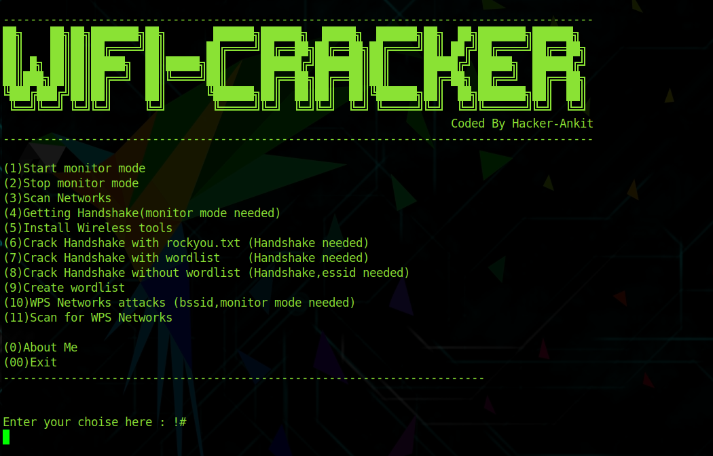
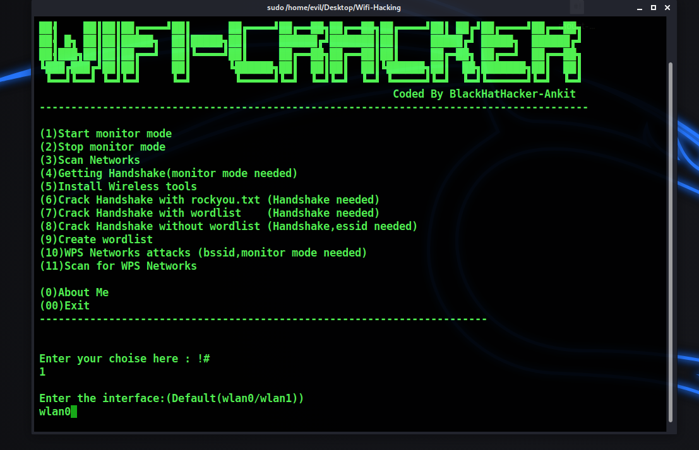
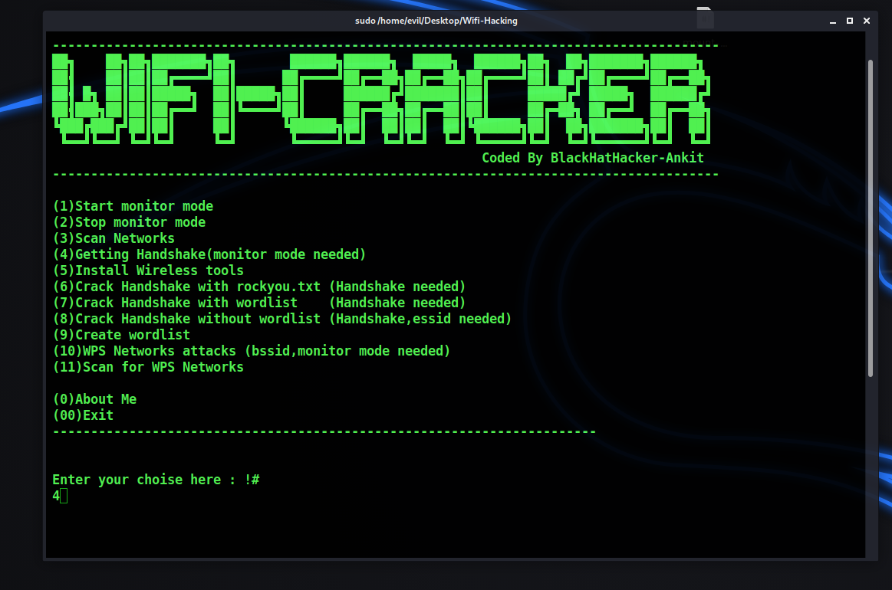
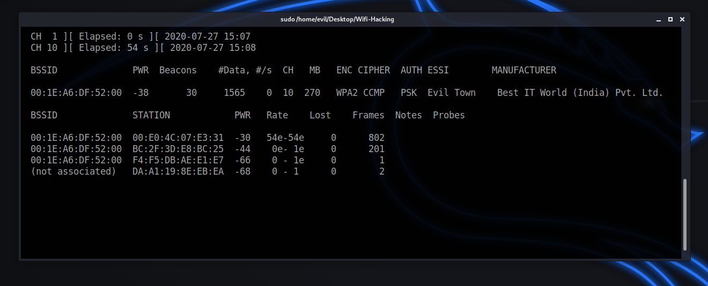
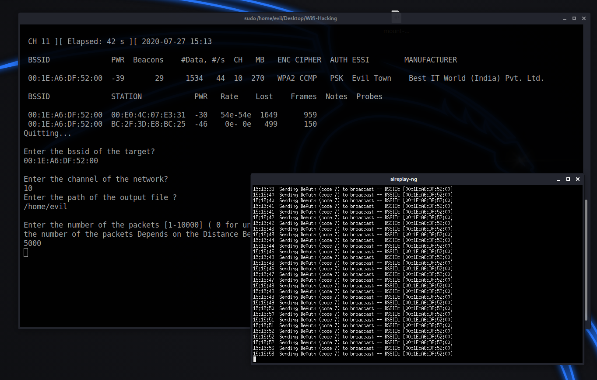
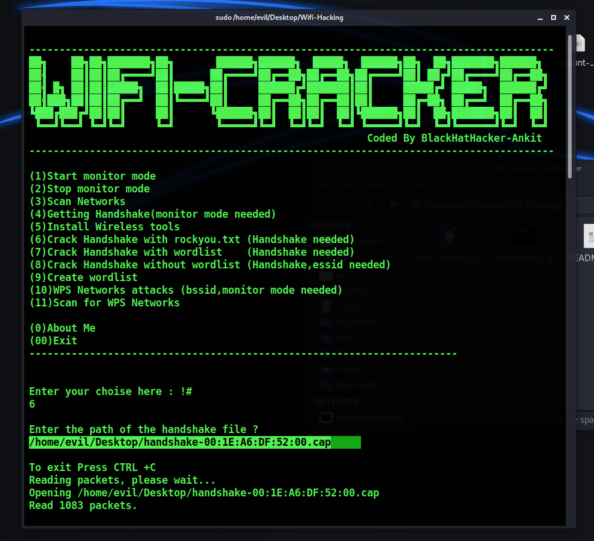
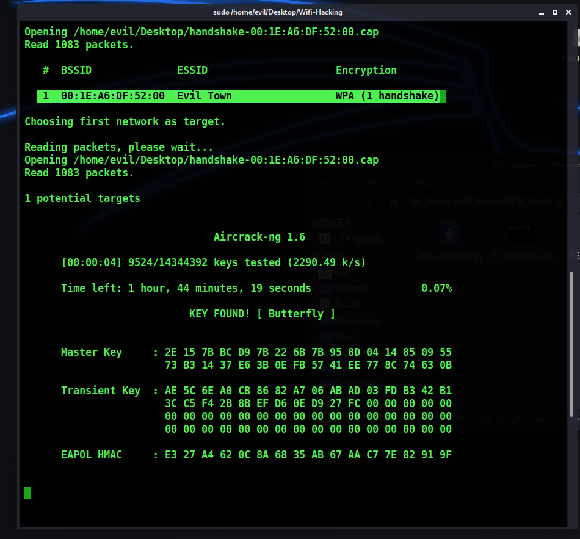
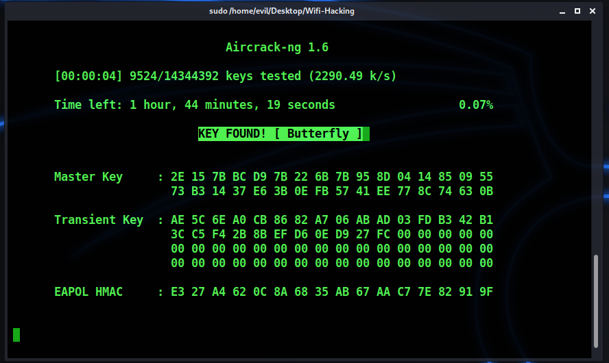

[](http://www.python.org/download/)
[](https://www.python.org/downloads/release/python-2714/)
[](https://termux.com/)


# Wifi-Hacking.py  


No Need To Ask Wifi Password, HACK it..! This Cyber Security Tool, Will Hack For You Any Wifi-Password..!


## Feutures and Contains :


```bash 
1)Start monitor mode

2)Stop monitor mode

3)Scan Networks   

4)Getting Handshake

5)Create wordlist

6)Install Wireless tools                  

7)WPS Networks attacks 

8)Scan for WPS Networks

9)Crack Handshake with rockyou.txt

10)Crack Handshake with wordlist

11)Crack Handshake without wordlist
```

## Tested On :

* Kali Linux
* BlackArch Linux
* Ubuntu
* Kali Nethunter
* Termux
* Parrot OS


# Installation


### Kali Linux / Ubuntu / Parrot OS

```bash
1) sudo apt-get update && apt-get install git
2) sudo git clone https://github.com/ankit0183/Wifi-Hacking
3) cd Wifi-Hacking/
4) sudo python3 Wifi-Hacking.py
```

## Creator

(Ankit Kanojiya) Hey, Dont Forget To say Thanks me :smile:


# SCREENSHOT












# Feel Free To Contact Me.


- [Instagram](https://www.instagram.com/ankit_kanojiya57/)


- [Whats App](https://wa.me/+919768367597)
 

### Whats App Me: +919768367597   - [Click Hear](https://wa.me/+919768367597)


# Disclaimer 


Wifi-Hacking tool not responsible for misuse and for illegal purposes. Use it only for Pentest or Educational purpose :smile: !!!


> Pull requests are always welcome.. :)  


###### Donation

If this CyberSecurity tool has been useful for you, feel free to thank me by buying me a coffee. :)
 
 
 
 
### Happy Hacking ( Privacy & Security No Such Things Exists in digital World, We Can Hack Everything )


